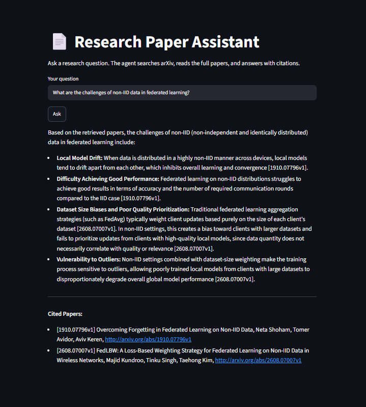
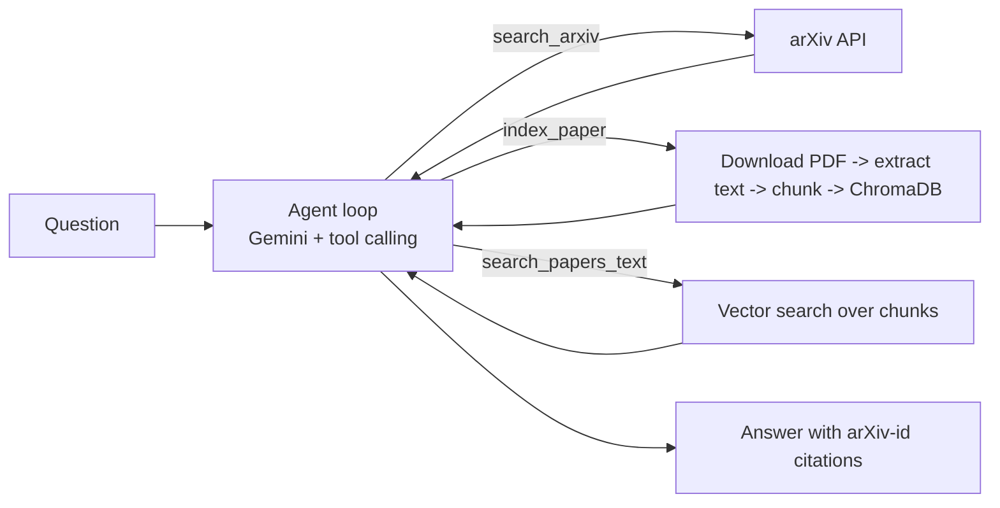

# Research Paper Assistant Agent

An LLM agent that answers research questions from real papers. You ask a question; the agent searches arXiv, downloads and reads the full text of the most relevant papers, retrieves the passages that matter, and writes an answer where every claim carries an arXiv-id citation.

**Live demo:** https://research-paper-agent26.streamlit.app


_Add a screenshot or short demo GIF at docs/screenshot.png._

## How it works



1. **search_arxiv** finds candidate papers (title, authors, date, abstract, id, URL).
2. **index_paper** downloads a paper's PDF, extracts the text, drops the reference list, splits it into overlapping chunks (900 characters, 100 overlap), and stores them in ChromaDB.
3. **search_papers_text** retrieves the chunks closest in meaning to a question, with their paper ids.
4. The model decides which tools to call and when to stop. The loop is written by hand (no agent framework) with a step limit as a safety net.
5. The system prompt requires: read at least two papers before answering, cite every claim as `[arXiv id]`, and say "Not covered in the retrieved papers" instead of guessing.

## Tech stack

Python, Google Gemini API (function calling), ChromaDB (default embedding model), `arxiv`, `pypdf`, Streamlit.

## Run it locally

```
git clone https://github.com/kirtipandey2/Research-Paper-Agent-
cd Research-Paper-Agent-
python -m venv .venv
.venv\Scripts\activate            # Windows
source .venv/bin/activate         # Mac/Linux
python -m pip install -r requirements.txt
```

Create a `.env` file in the project root:

```
GEMINI_API_KEY=your_key_here
```

Then run either:

```
python src/agent.py                      # command-line version
python -m streamlit run src/app.py       # web app
```

The model name is set in `src/agent.py` (`MODEL`). Model names change over time, so update it if the API reports the model as unavailable.

## Project structure

```
src/
  agent.py       agent loop, tool descriptions, system prompt
  tools.py       arXiv search, PDF download, PDF text extraction
  rag.py         chunking, ChromaDB indexing, passage search
  app.py         Streamlit interface
  eval.py        runs the 10-question evaluation, saves eval_results.json
  rescore.py     recomputes citation metrics from a saved evaluation file
  check.py, quickcheck.py   helpers for checking answers by hand
```

## Evaluation

I tested the agent on 10 research questions (federated learning, ADMM, UAV communication, RAG, and others). Because the agent calls an LLM, results vary a little from run to run, so treat small differences as noise.

| | Baseline | After requiring full-text reading | After labelling abstract-only claims |
|---|---|---|---|
| Runs that read full paper text | 7 / 10 | 10 / 10 | 9 / 10 |
| Citations to papers never retrieved | 0 | 0 | 0 |
| Cited papers backed by retrieved full-text passages | 11 / 28 (39%) | 13 / 26 (50%) | 17 / 27 (63%) |

**Manual accuracy check (baseline run).** I checked 14 claims from four answers against the source text: **8 fully supported, 6 partly supported, 0 unsupported.** "Partly" meant the cited paper supported the core of the claim, but the answer added detail the paper did not state (typically a textbook definition the model supplied from its own knowledge). The answers that relied on abstracts only had the most "partly supported" claims.

What the metrics do and do not show:
- "Cited papers backed by retrieved passages" counts a paper as backed if at least one of its passages was retrieved. It does not prove that a particular claim came from that passage.
- The sentence-level citation rate (about 86% in the latest run) is approximate because sentences are split with a simple rule.
- The manual check covers 14 claims and has not been repeated on the latest version. Citation checks measure citation behaviour, not whether a paper itself is correct.

## Known limitations

- **Abstract-only answers drift.** When the agent answers from abstracts, it can add background that the cited paper does not contain.
- **Vector search always returns something.** Even for an unrelated question, the nearest chunks come back, so the model has to judge relevance itself.
- **Reference-list removal is a heuristic.** Text after the last "References" heading is dropped, which also removes appendices.
- **PDF text is messy.** Extraction can glue words together or garble equations, which hurts retrieval on math-heavy papers.
- **Free-tier rate limits.** Long runs can hit API quotas; the evaluation script pauses between questions for this reason.
- **Small evaluation.** Ten questions and one manual check are enough to find failure modes, not to claim general accuracy.

## Possible next steps

- Filter retrieved chunks by distance score and rerank them.
- Verify each claim against its cited passage automatically.
- Show the retrieved passages next to the answer in the app.
- Cache indexed papers across sessions and add more test questions.
